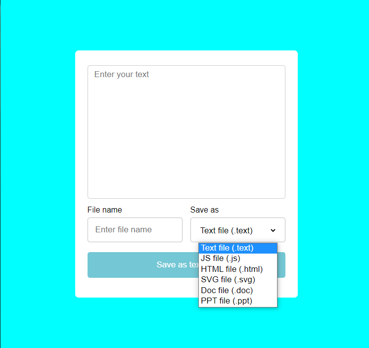

# Text to file saver

## Welcome to "Text To File Converter" app 👋

## Description

This app takes an unlimited text from the user and convert it to to one od the files in the select menu and the user can download the file by clicking the button.

## Concepts

You are going to learn how to use the `Blob()` and `createObjectURL()` constructers to build the file and create the functionality to download it.

## Technology

The app was built with HTML, CSS, vanilla JavaScript and its totalyy beginner friendly.

## Demo

Give it a try here 👉 [Demo](https://roudi22.github.io/Text-file/)

**Feel free to clone the repo and make some changes**

**HAPPY CODING 🚀**
